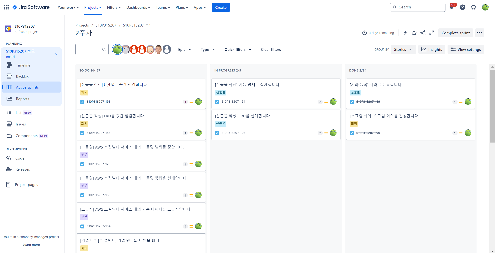

>   
> 
> **우리 팀의 일정 관리 방식**
>  
> 1. 매주 월요일 오전 9시에 진행하는 스크럼 회의에서 공통 일정을 `Notion Calendar`에 정리한다. 공통 일정은 산출물 작성, 회의, 기업 미팅 등이 있다.
> 2. 이후 남은 시간에는 개인 업무를 1시간 단위로 나눠 정리한다.
> 3. 정리한 일정을 기반으로 `Jira`에 등록한다.

우리 팀이 정한 Jira 컨벤션은 다음과 같다.

**Epic**
- 공통 업무 혹은 도메인
    - e.g: 회의, 발표, 로드맵, 산출물 등

**Story**
- 프론트엔드는 페이지 단위로 나눈다.
    - e.g: 메인  페이지, 커뮤니티 상세 페이지 등
- 백엔드는 도메인별 단계로 나눈다.
    - 챗봇 크롤링, 챗봇 api 설계 등

**Task**
- [스토리명] 상세 업무 와 같은 형식으로 등록한다.
- 스토리 별 task를 확인할 수 있도록 링크한다.
    - e.g: [API 설계] 로드맵 전체 조회 API를 설계합니다.

완성된 Jira 모습은 다음과 같다.
